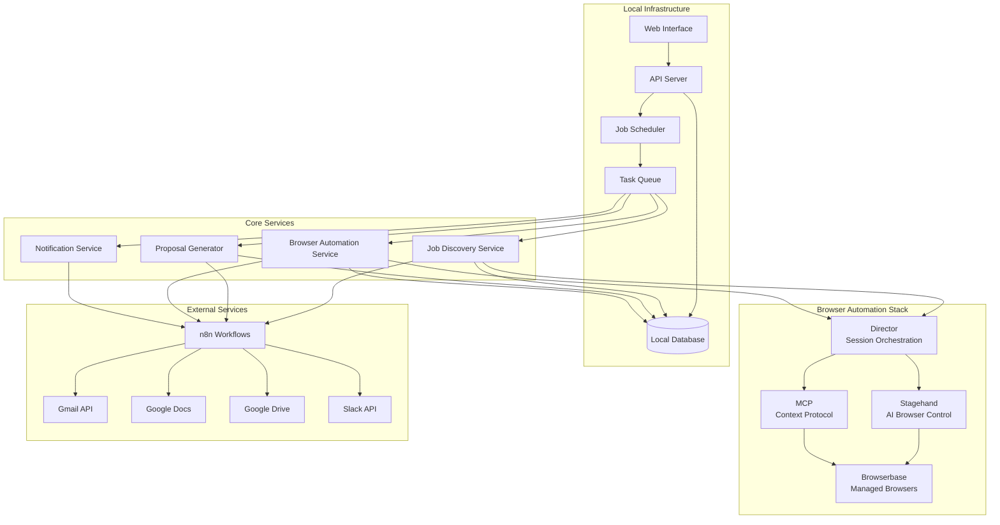
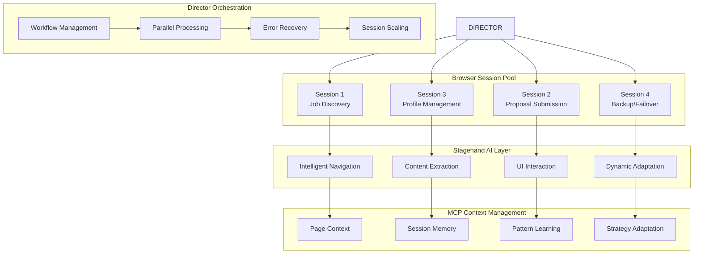

# Design Document

## Overview

The Upwork Automation System is designed as a locally-hosted application that automates the job discovery, proposal generation, and application submission process for Salesforce Agentforce Developer positions. The system scales from 2-3 manual applications to 20-30 automated applications per day while maintaining platform compliance and account safety.

The architecture follows a microservices approach with clear separation of concerns: job discovery, proposal generation, browser automation, and monitoring. All components run locally with integrations to cloud services (Browserbase, n8n, Google Workspace) for enhanced capabilities.

## Architecture

### High-Level Architecture



### Browser Automation Architecture Deep Dive



### Component Architecture

The system is built using a browser-automation-centric architecture with the following key components:

1. **Browser Automation Layer**: Browserbase + Stagehand + Director + MCP for intelligent browser control
2. **n8n Orchestration**: Workflow automation connecting browser actions with business logic
3. **Web Interface**: React-based dashboard for monitoring and control
4. **API Server**: FastAPI-based REST API for all system operations
5. **Job Scheduler**: Cron-like scheduler for automated job discovery and processing
6. **Task Queue**: Redis-based queue for asynchronous task processing
7. **Core Services**: Specialized services for each major function
8. **Database**: PostgreSQL for persistent data storage

**Browser Automation Stack**:
- **Browserbase**: Managed browser infrastructure with 4 vCPU per browser, session persistence, stealth mode, proxy support
- **Stagehand**: AI-powered browser automation for complex UI interactions and dynamic content handling
- **Director**: Multi-session orchestration and workflow management for parallel processing
- **MCP**: Model Context Protocol for AI agent integration with browser contexts
- **n8n**: Low-code workflow automation connecting browser automation with external services

## Components and Interfaces

### 1. Web Interface

**Technology**: React with TypeScript, Material-UI for components

**Key Features**:
- Real-time dashboard showing job queue status and metrics
- Job detail views with proposal preview and edit capabilities
- System configuration and filter management
- Performance analytics and success rate tracking
- Manual override controls for pausing/resuming automation

**API Integration**: RESTful API calls to the local API server with WebSocket connections for real-time updates.

### 2. API Server

**Technology**: FastAPI with Python, SQLAlchemy ORM

**Endpoints**:
```
GET /api/jobs - List jobs with filtering and pagination
GET /api/jobs/{id} - Get specific job details
POST /api/jobs/{id}/apply - Manually trigger application
PUT /api/jobs/{id} - Update job status or proposal
GET /api/metrics - System performance metrics
POST /api/settings - Update system configuration
GET /api/queue/status - Current queue status
```

**Authentication**: JWT-based authentication for web interface access

### 3. Job Discovery Service

**Technology**: Browserbase + Stagehand + n8n integration

**Advanced Browser-Based Discovery**:
The job discovery service leverages the full browser automation stack for intelligent job hunting:

**Responsibilities**:
- **AI-Powered Job Search**: Stagehand for intelligent navigation and search optimization
- **Dynamic Content Handling**: MCP for adapting to Upwork's changing UI and anti-bot measures
- **Multi-Session Parallel Discovery**: Director orchestrating multiple browser sessions for faster discovery
- **Context-Aware Filtering**: AI agents understanding job context beyond simple keyword matching
- **n8n Workflow Integration**: Connecting browser discovery with Gmail alerts and notification systems

**Enhanced Discovery Workflow**:
```python
class JobDiscoveryService:
    def __init__(self):
        self.browserbase = BrowserbaseClient()
        self.stagehand = StagehandController()
        self.director = DirectorOrchestrator()
        self.mcp = MCPClient()
        self.n8n = N8NClient()
    
    async def intelligent_job_search(self, search_params: SearchParams) -> List[Job]:
        # Create multiple browser sessions for parallel searching
        sessions = await self.director.create_session_pool(size=3)
        
        # Distribute search across different strategies
        search_strategies = [
            {"keywords": ["Salesforce Agentforce"], "sort": "newest"},
            {"keywords": ["Salesforce AI", "Einstein"], "sort": "best_match"},
            {"keywords": ["Salesforce Developer"], "filters": ["payment_verified", "high_rating"]}
        ]
        
        # Execute parallel searches using Stagehand
        search_tasks = []
        for i, strategy in enumerate(search_strategies):
            task = self.execute_search_strategy(sessions[i], strategy)
            search_tasks.append(task)
        
        # Combine and deduplicate results
        all_jobs = []
        for task in asyncio.as_completed(search_tasks):
            jobs = await task
            all_jobs.extend(jobs)
        
        return await self.deduplicate_and_rank(all_jobs)
    
    async def execute_search_strategy(self, session_id: str, strategy: dict) -> List[Job]:
        # Use Stagehand for intelligent search execution
        page = await self.stagehand.get_page(session_id)
        
        # AI-powered search with dynamic adaptation
        await self.stagehand.act(page, f"navigate to upwork job search")
        await self.stagehand.act(page, f"search for: {' '.join(strategy['keywords'])}")
        await self.stagehand.act(page, f"apply sorting: {strategy['sort']}")
        
        if 'filters' in strategy:
            for filter_type in strategy['filters']:
                await self.stagehand.act(page, f"apply filter: {filter_type}")
        
        # Extract job listings with AI understanding
        jobs_data = await self.stagehand.extract(page, 
            "extract all job listings with: title, client name, budget, hourly rate, "
            "client rating, payment verified status, job description preview, posted time, "
            "number of proposals, hire rate"
        )
        
        # Process each job for detailed extraction
        detailed_jobs = []
        for job_data in jobs_data:
            try:
                detailed_job = await self.extract_detailed_job_info(session_id, job_data)
                detailed_jobs.append(detailed_job)
            except Exception as e:
                # Log error but continue processing other jobs
                await self.log_extraction_error(job_data, e)
        
        return detailed_jobs
    
    async def extract_detailed_job_info(self, session_id: str, job_data: dict) -> Job:
        # Navigate to individual job page for detailed extraction
        page = await self.stagehand.get_page(session_id)
        await self.stagehand.act(page, f"navigate to job: {job_data['url']}")
        
        # Use MCP for context-aware extraction
        context = await self.mcp.analyze_page_context(session_id)
        
        # Extract comprehensive job details
        detailed_info = await self.stagehand.extract(page,
            "extract complete job information: full description, required skills, "
            "client history, similar jobs posted, budget details, timeline, "
            "application requirements, preferred qualifications"
        )
        
        # Combine basic and detailed information
        return Job(
            id=job_data['id'],
            title=job_data['title'],
            description=detailed_info['full_description'],
            budget_min=detailed_info.get('budget_min'),
            budget_max=detailed_info.get('budget_max'),
            hourly_rate=detailed_info.get('hourly_rate'),
            client_rating=job_data['client_rating'],
            client_payment_verified=job_data['payment_verified'],
            skills_required=detailed_info['required_skills'],
            posted_date=job_data['posted_time'],
            # ... additional fields
        )
    
    async def ai_powered_filtering(self, jobs: List[Job]) -> List[Job]:
        # Use MCP for intelligent job filtering beyond simple rules
        filtered_jobs = []
        
        for job in jobs:
            # AI agent analyzes job fit
            analysis = await self.mcp.analyze_job_fit({
                "job": job.dict(),
                "profile": "salesforce-agentforce-developer",
                "success_history": await self.get_historical_success_patterns()
            })
            
            if analysis['recommended'] and analysis['confidence'] > 0.7:
                job.match_score = analysis['confidence']
                job.match_reasons = analysis['reasons']
                filtered_jobs.append(job)
        
        return sorted(filtered_jobs, key=lambda x: x.match_score, reverse=True)
    
    async def integrate_with_n8n_workflows(self, discovered_jobs: List[Job]):
        # Trigger n8n workflows for discovered jobs
        for job in discovered_jobs:
            await self.n8n.trigger_workflow("job-discovered", {
                "job_data": job.dict(),
                "discovery_timestamp": datetime.utcnow().isoformat(),
                "discovery_method": "browser_automation"
            })
```

**Integration with n8n Workflows**:
- **Job Discovery Triggers**: Automatically trigger proposal generation workflows
- **Gmail Alert Processing**: Combine browser discovery with email alert parsing
- **Slack Notifications**: Send rich job notifications with browser-captured screenshots
- **Google Docs Integration**: Automatically create proposal drafts with job context

### 4. Proposal Generator

**Technology**: Python with OpenAI API, Google Docs API

**Responsibilities**:
- LLM-based proposal generation using job-specific context
- Template management and customization
- Google Docs integration for proposal storage
- Attachment selection from Google Drive assets

**Template Structure**:
```python
class ProposalTemplate:
    def generate_paragraph_1(self, job: Job) -> str:
        # Goal-focused intro with Agentforce approach
    
    def generate_paragraph_2(self, job: Job) -> str:
        # Similar project experience with metrics
    
    def generate_paragraph_3(self, job: Job) -> str:
        # Clear CTA with next steps
    
    def add_skill_bullets(self, job: Job) -> List[str]:
        # Optional certification/skill bullets
```

### 5. Browser Automation Service

**Technology**: Browserbase with Stagehand, Director, MCP integration, n8n orchestration

**Core Architecture**:
The browser automation is the heart of this system, leveraging Browserbase's managed browser infrastructure with advanced automation frameworks:

- **Browserbase**: Managed headless browsers with 4 vCPU per browser, session recording, stealth capabilities, and proxy support
- **Stagehand**: AI-powered browser automation for complex UI interactions and dynamic content handling
- **Director**: Orchestration layer for managing multiple browser sessions and workflows
- **MCP (Model Context Protocol)**: Integration layer for AI agents to interact with browser contexts
- **n8n**: Workflow orchestration connecting browser automation with other services

**Detailed Responsibilities**:
- **Session Management**: Persistent browser sessions across multiple job applications with context preservation
- **Stealth Operations**: Advanced fingerprinting, proxy rotation, and human-like interaction patterns
- **AI-Powered Navigation**: Stagehand for intelligent element detection and interaction in dynamic Upwork UI
- **Multi-Session Orchestration**: Director managing parallel browser sessions for scaled application processing
- **Context-Aware Automation**: MCP enabling AI agents to understand and adapt to changing page contexts
- **Workflow Integration**: n8n connecting browser actions with proposal generation, notifications, and data storage

**Browser Automation Workflow**:
```python
class BrowserAutomationService:
    def __init__(self):
        self.browserbase_client = BrowserbaseClient()
        self.stagehand = StagehandController()
        self.director = DirectorOrchestrator()
        self.mcp_client = MCPClient()
    
    async def create_session_pool(self, pool_size: int = 5):
        # Create multiple browser sessions for parallel processing
        sessions = []
        for i in range(pool_size):
            session = await self.browserbase_client.create_session({
                "projectId": "upwork-automation",
                "proxies": True,
                "stealth": True,
                "keepAlive": True
            })
            sessions.append(session)
        return sessions
    
    async def login_and_maintain_session(self, session_id: str):
        # Use Stagehand for intelligent login handling
        page = await self.stagehand.get_page(session_id)
        await self.stagehand.act(page, "navigate to upwork login")
        await self.stagehand.act(page, "fill login credentials securely")
        await self.stagehand.act(page, "handle any 2FA or captcha challenges")
        
        # Store session context in MCP for reuse
        context = await self.mcp_client.save_session_context(session_id, {
            "logged_in": True,
            "user_profile": "salesforce-agentforce-developer",
            "session_cookies": await page.context.cookies()
        })
    
    async def search_and_extract_jobs(self, session_id: str, keywords: List[str]):
        # AI-powered job discovery using Stagehand
        page = await self.stagehand.get_page(session_id)
        
        # Navigate to job search with intelligent interaction
        await self.stagehand.act(page, f"search for jobs with keywords: {', '.join(keywords)}")
        await self.stagehand.act(page, "apply filters: hourly rate $50+, client rating 4.0+, payment verified")
        
        # Extract job details using AI understanding
        jobs = await self.stagehand.extract(page, "extract all job listings with details: title, budget, client info, description")
        
        # Process each job with detailed extraction
        detailed_jobs = []
        for job in jobs:
            job_details = await self.extract_job_details(session_id, job['url'])
            detailed_jobs.append(job_details)
        
        return detailed_jobs
    
    async def submit_proposal(self, session_id: str, job_url: str, proposal: Proposal):
        # Use Director to orchestrate complex submission workflow
        workflow = await self.director.create_workflow("proposal_submission", {
            "session_id": session_id,
            "job_url": job_url,
            "proposal_data": proposal.dict()
        })
        
        # Execute multi-step submission process
        steps = [
            {"action": "navigate_to_job", "params": {"url": job_url}},
            {"action": "click_apply_button", "params": {}},
            {"action": "fill_proposal_form", "params": {"content": proposal.content}},
            {"action": "set_bid_amount", "params": {"amount": proposal.bid_amount}},
            {"action": "attach_files", "params": {"attachments": proposal.attachments}},
            {"action": "review_and_submit", "params": {"confirm": True}}
        ]
        
        for step in steps:
            result = await self.director.execute_step(workflow, step)
            if not result.success:
                await self.handle_submission_error(workflow, step, result.error)
        
        return await self.director.get_workflow_result(workflow)
    
    async def handle_dynamic_content(self, session_id: str, page_context: str):
        # Use MCP for context-aware handling of dynamic content
        context = await self.mcp_client.get_page_context(session_id)
        
        # AI agent analyzes page changes and adapts strategy
        adaptation = await self.mcp_client.analyze_and_adapt({
            "current_context": context,
            "page_changes": page_context,
            "automation_goal": "submit_proposal"
        })
        
        return adaptation
```

**Advanced Features**:
- **Session Recording**: Full session recording for debugging and compliance
- **Live View**: Real-time session monitoring during development and troubleshooting
- **Proxy Management**: Automatic proxy rotation to avoid IP-based rate limiting
- **Captcha Handling**: Intelligent captcha detection and solving integration
- **Error Recovery**: Sophisticated error handling with context preservation
- **Performance Optimization**: Session pooling and resource management for scaled operations

### 6. n8n Workflow Orchestration

**Technology**: n8n with custom nodes and webhook integrations

**Core Workflows**:

**Job Discovery Workflow**:
```yaml
workflow_name: "job-discovery-pipeline"
trigger: 
  - type: "cron"
    schedule: "*/30 * * * *"  # Every 30 minutes
  - type: "webhook"
    path: "/trigger/job-discovery"

nodes:
  - name: "browser-job-search"
    type: "http-request"
    method: "POST"
    url: "http://localhost:8000/api/browser/search-jobs"
    parameters:
      keywords: ["Salesforce Agentforce", "Salesforce AI"]
      session_pool_size: 3
  
  - name: "filter-and-rank"
    type: "function"
    code: |
      // AI-powered job filtering and ranking
      const jobs = $input.all();
      return jobs.filter(job => 
        job.client_rating >= 4.0 && 
        job.hourly_rate >= 50 &&
        job.payment_verified === true
      ).sort((a, b) => b.match_score - a.match_score);
  
  - name: "slack-notification"
    type: "slack"
    operation: "postMessage"
    channel: "#upwork-automation"
    message: "🎯 Found {{$json.length}} new jobs matching criteria"
    attachments:
      - title: "Top Job: {{$json[0].title}}"
        text: "Budget: ${{$json[0].hourly_rate}}/hr | Rating: {{$json[0].client_rating}}⭐"
        color: "good"
  
  - name: "trigger-proposal-generation"
    type: "webhook"
    method: "POST"
    url: "http://localhost:8000/api/proposals/generate-batch"
    body: "{{$json}}"
```

**Proposal Generation Workflow**:
```yaml
workflow_name: "proposal-generation-pipeline"
trigger:
  - type: "webhook"
    path: "/trigger/proposal-generation"

nodes:
  - name: "analyze-job-requirements"
    type: "openai"
    operation: "chat"
    model: "gpt-4"
    messages:
      - role: "system"
        content: "Analyze this Upwork job and extract key requirements for a Salesforce Agentforce Developer proposal"
      - role: "user"
        content: "{{$json.job_description}}"
  
  - name: "generate-proposal-content"
    type: "http-request"
    method: "POST"
    url: "http://localhost:8000/api/proposals/generate"
    body:
      job_id: "{{$json.job_id}}"
      analysis: "{{$node['analyze-job-requirements'].json.choices[0].message.content}}"
  
  - name: "create-google-doc"
    type: "google-docs"
    operation: "create"
    title: "Proposal - {{$json.job_title}}"
    content: "{{$node['generate-proposal-content'].json.proposal_content}}"
  
  - name: "select-attachments"
    type: "google-drive"
    operation: "search"
    query: "Salesforce case study OR Agentforce demo"
    maxResults: 3
  
  - name: "queue-for-submission"
    type: "http-request"
    method: "POST"
    url: "http://localhost:8000/api/queue/add"
    body:
      task_type: "submit_proposal"
      job_id: "{{$json.job_id}}"
      proposal_doc_id: "{{$node['create-google-doc'].json.documentId}}"
      attachments: "{{$node['select-attachments'].json.files}}"
```

**Browser Automation Workflow**:
```yaml
workflow_name: "browser-submission-pipeline"
trigger:
  - type: "webhook"
    path: "/trigger/browser-submission"

nodes:
  - name: "get-browser-session"
    type: "http-request"
    method: "POST"
    url: "http://localhost:8000/api/browser/get-session"
    body:
      session_type: "proposal_submission"
      stealth_mode: true
  
  - name: "stagehand-navigate"
    type: "http-request"
    method: "POST"
    url: "http://localhost:8000/api/browser/stagehand/navigate"
    body:
      session_id: "{{$node['get-browser-session'].json.session_id}}"
      job_url: "{{$json.job_url}}"
      action: "navigate to job and click apply"
  
  - name: "stagehand-fill-proposal"
    type: "http-request"
    method: "POST"
    url: "http://localhost:8000/api/browser/stagehand/fill-form"
    body:
      session_id: "{{$node['get-browser-session'].json.session_id}}"
      proposal_content: "{{$json.proposal_content}}"
      bid_amount: "{{$json.bid_amount}}"
      attachments: "{{$json.attachments}}"
  
  - name: "director-submit"
    type: "http-request"
    method: "POST"
    url: "http://localhost:8000/api/browser/director/submit"
    body:
      session_id: "{{$node['get-browser-session'].json.session_id}}"
      confirm_submission: true
  
  - name: "capture-confirmation"
    type: "http-request"
    method: "POST"
    url: "http://localhost:8000/api/browser/capture-result"
    body:
      session_id: "{{$node['get-browser-session'].json.session_id}}"
      capture_screenshot: true
  
  - name: "slack-success-notification"
    type: "slack"
    operation: "postMessage"
    channel: "#upwork-automation"
    message: "✅ Successfully submitted proposal for: {{$json.job_title}}"
    attachments:
      - title: "Submission Details"
        text: "Bid: ${{$json.bid_amount}}/hr | Attachments: {{$json.attachments.length}}"
        image_url: "{{$node['capture-confirmation'].json.screenshot_url}}"
```

### 7. Notification Service

**Technology**: n8n + Slack SDK integration

**Enhanced Notification System**:
- **Real-time Job Alerts**: Rich Slack cards with job details and browser screenshots
- **Proposal Status Updates**: Live updates on proposal generation and submission
- **Error Handling Alerts**: Immediate notifications for browser automation failures
- **Performance Dashboards**: Daily/weekly summary reports with success metrics
- **Interactive Controls**: Slack buttons for manual overrides and emergency stops

## Data Models

### Job Model
```python
class Job(BaseModel):
    id: str
    title: str
    description: str
    budget_min: Optional[float]
    budget_max: Optional[float]
    hourly_rate: Optional[float]
    client_rating: float
    client_payment_verified: bool
    client_hire_rate: float
    posted_date: datetime
    deadline: Optional[datetime]
    skills_required: List[str]
    job_type: JobType  # FIXED, HOURLY
    location: Optional[str]
    status: JobStatus  # DISCOVERED, FILTERED, QUEUED, APPLIED, REJECTED
    match_score: float
    created_at: datetime
    updated_at: datetime
```

### Proposal Model
```python
class Proposal(BaseModel):
    id: str
    job_id: str
    content: str
    bid_amount: float
    attachments: List[str]  # Google Drive file IDs
    google_doc_url: str
    generated_at: datetime
    submitted_at: Optional[datetime]
    status: ProposalStatus  # DRAFT, SUBMITTED, ACCEPTED, REJECTED
```

### Application Model
```python
class Application(BaseModel):
    id: str
    job_id: str
    proposal_id: str
    submitted_at: datetime
    upwork_application_id: Optional[str]
    status: ApplicationStatus
    client_response: Optional[str]
    client_response_date: Optional[datetime]
    interview_scheduled: bool
    hired: bool
```

### System Configuration Model
```python
class SystemConfig(BaseModel):
    daily_application_limit: int = 30
    min_hourly_rate: float = 50.0
    target_hourly_rate: float = 75.0
    min_client_rating: float = 4.0
    min_hire_rate: float = 0.5
    keywords_include: List[str]
    keywords_exclude: List[str]
    automation_enabled: bool = True
    notification_channels: List[str]
```

## Error Handling

### Browser Automation Errors
- **Session Timeout**: Automatic session refresh with exponential backoff
- **CAPTCHA Detection**: Pause automation and send alert notification
- **Rate Limiting**: Implement delays and reduce application frequency
- **Login Failures**: Alert team and require manual intervention

### API Integration Errors
- **Google Services**: Retry with exponential backoff, fallback to local storage
- **Slack Notifications**: Queue failed notifications for retry
- **Browserbase**: Switch to backup browser sessions or pause automation

### Data Consistency
- **Database Transactions**: Use database transactions for multi-step operations
- **Queue Processing**: Implement idempotent task processing with unique job IDs
- **State Management**: Regular state synchronization between services

## Testing Strategy

### Unit Testing
- **Service Layer**: Mock external dependencies, test business logic
- **Data Models**: Validate model constraints and relationships
- **API Endpoints**: Test request/response handling and validation
- **Browser Automation**: Mock Browserbase interactions, test flow logic

### Integration Testing
- **End-to-End Workflows**: Test complete job discovery to application flow
- **External Service Integration**: Test with actual APIs in staging environment
- **Database Operations**: Test data persistence and retrieval
- **Queue Processing**: Test task distribution and completion

### Performance Testing
- **Load Testing**: Simulate high job volumes and concurrent processing
- **Browser Session Management**: Test session pooling and cleanup
- **Database Performance**: Test query performance with large datasets
- **Memory Usage**: Monitor memory consumption during extended runs

### Safety Testing
- **Rate Limiting**: Verify application frequency stays within safe limits
- **Error Recovery**: Test system behavior during various failure scenarios
- **Data Validation**: Test input sanitization and validation
- **Security**: Test credential handling and API security

## Deployment Architecture

### Local Infrastructure
```yaml
services:
  api-server:
    build: ./api
    ports: ["8000:8000"]
    environment:
      - DATABASE_URL=postgresql://user:pass@db:5432/upwork_automation
      - REDIS_URL=redis://redis:6379
    depends_on: [db, redis]
  
  web-interface:
    build: ./web
    ports: ["3000:3000"]
    environment:
      - REACT_APP_API_URL=http://localhost:8000
  
  worker:
    build: ./worker
    environment:
      - DATABASE_URL=postgresql://user:pass@db:5432/upwork_automation
      - REDIS_URL=redis://redis:6379
    depends_on: [db, redis]
  
  scheduler:
    build: ./scheduler
    environment:
      - DATABASE_URL=postgresql://user:pass@db:5432/upwork_automation
    depends_on: [db]
  
  db:
    image: postgres:15
    environment:
      - POSTGRES_DB=upwork_automation
      - POSTGRES_USER=user
      - POSTGRES_PASSWORD=pass
    volumes: ["./data/postgres:/var/lib/postgresql/data"]
  
  redis:
    image: redis:7
    volumes: ["./data/redis:/data"]
```

### Configuration Management
- **Environment Variables**: Sensitive configuration stored in .env files
- **Config Files**: Application settings in YAML/JSON configuration files
- **Secrets Management**: API keys encrypted and stored securely
- **Feature Flags**: Runtime configuration for enabling/disabling features

### Monitoring and Logging
- **Application Logs**: Structured logging with correlation IDs
- **Performance Metrics**: Custom metrics for job processing and success rates
- **Health Checks**: Endpoint monitoring for all services
- **Alerting**: Automated alerts for system failures and performance issues

## MCP (Model Context Protocol) Integration

### MCP Architecture for Browser Automation

The Model Context Protocol serves as the intelligence layer that enables AI agents to understand, adapt to, and learn from browser interactions:

**Core MCP Components**:

```python
class MCPBrowserAgent:
    def __init__(self):
        self.context_manager = MCPContextManager()
        self.learning_engine = MCPLearningEngine()
        self.adaptation_engine = MCPAdaptationEngine()
    
    async def analyze_page_context(self, session_id: str, page_url: str) -> PageContext:
        """Analyze current page state and extract actionable context"""
        page_data = await self.browserbase.get_page_content(session_id)
        
        context = await self.context_manager.analyze({
            "url": page_url,
            "html_content": page_data.html,
            "dom_structure": page_data.dom,
            "visible_elements": page_data.visible_elements,
            "interactive_elements": page_data.interactive_elements
        })
        
        return PageContext(
            page_type=context.page_type,  # "job_listing", "application_form", "profile_page"
            key_elements=context.key_elements,
            interaction_opportunities=context.interactions,
            potential_obstacles=context.obstacles,  # captchas, rate limits, etc.
            confidence_score=context.confidence
        )
    
    async def adapt_automation_strategy(self, current_context: PageContext, 
                                      automation_goal: str) -> AutomationStrategy:
        """Dynamically adapt automation approach based on page context"""
        
        # Analyze current situation
        situation_analysis = await self.adaptation_engine.analyze_situation({
            "context": current_context,
            "goal": automation_goal,
            "historical_patterns": await self.get_historical_patterns(current_context.page_type),
            "recent_failures": await self.get_recent_failures(current_context.url)
        })
        
        # Generate adaptive strategy
        strategy = await self.adaptation_engine.generate_strategy({
            "situation": situation_analysis,
            "available_tools": ["stagehand", "playwright", "direct_api"],
            "risk_tolerance": "medium",
            "success_criteria": automation_goal
        })
        
        return AutomationStrategy(
            primary_approach=strategy.primary_approach,
            fallback_approaches=strategy.fallbacks,
            timing_strategy=strategy.timing,
            interaction_patterns=strategy.patterns,
            success_indicators=strategy.success_indicators,
            failure_indicators=strategy.failure_indicators
        )
    
    async def learn_from_interaction(self, interaction_result: InteractionResult):
        """Learn from successful and failed interactions to improve future performance"""
        
        learning_data = {
            "page_context": interaction_result.page_context,
            "action_taken": interaction_result.action,
            "result": interaction_result.result,
            "success": interaction_result.success,
            "timing": interaction_result.timing,
            "obstacles_encountered": interaction_result.obstacles
        }
        
        # Update learning models
        await self.learning_engine.process_interaction(learning_data)
        
        # Update strategy patterns
        if interaction_result.success:
            await self.learning_engine.reinforce_pattern(
                pattern=interaction_result.successful_pattern,
                context=interaction_result.page_context
            )
        else:
            await self.learning_engine.learn_from_failure(
                failure=interaction_result.failure_reason,
                context=interaction_result.page_context,
                attempted_solution=interaction_result.action
            )
```

**MCP-Enhanced Browser Workflows**:

```python
class MCPEnhancedBrowserWorkflow:
    async def intelligent_job_application(self, job: Job) -> ApplicationResult:
        """Complete job application with MCP-powered intelligence"""
        
        # Phase 1: Context Analysis
        session_id = await self.browserbase.create_session()
        await self.stagehand.navigate(session_id, job.url)
        
        page_context = await self.mcp_agent.analyze_page_context(session_id, job.url)
        
        # Phase 2: Strategy Adaptation
        strategy = await self.mcp_agent.adapt_automation_strategy(
            page_context, 
            "submit_job_application"
        )
        
        # Phase 3: Intelligent Execution
        for step in strategy.execution_steps:
            try:
                # Execute step with MCP guidance
                result = await self.execute_step_with_mcp(session_id, step, page_context)
                
                # Learn from each interaction
                await self.mcp_agent.learn_from_interaction(result)
                
                # Adapt if needed
                if result.requires_adaptation:
                    new_context = await self.mcp_agent.analyze_page_context(session_id, result.current_url)
                    strategy = await self.mcp_agent.adapt_automation_strategy(new_context, "submit_job_application")
                
            except Exception as e:
                # MCP-powered error recovery
                recovery_strategy = await self.mcp_agent.generate_recovery_strategy(e, page_context)
                await self.execute_recovery(session_id, recovery_strategy)
        
        return ApplicationResult(
            success=True,
            application_id=result.application_id,
            lessons_learned=await self.mcp_agent.extract_lessons(session_id)
        )
    
    async def execute_step_with_mcp(self, session_id: str, step: AutomationStep, 
                                   context: PageContext) -> InteractionResult:
        """Execute automation step with MCP intelligence"""
        
        # Get MCP recommendations for this specific step
        recommendations = await self.mcp_agent.get_step_recommendations(step, context)
        
        # Choose best approach based on MCP analysis
        if recommendations.use_stagehand:
            result = await self.stagehand.act(session_id, step.action, recommendations.stagehand_params)
        elif recommendations.use_playwright:
            result = await self.playwright.execute(session_id, step.playwright_script)
        else:
            result = await self.custom_handler.execute(session_id, step.custom_action)
        
        # Validate result with MCP
        validation = await self.mcp_agent.validate_step_result(result, step.expected_outcome)
        
        return InteractionResult(
            step=step,
            result=result,
            success=validation.success,
            confidence=validation.confidence,
            lessons=validation.lessons,
            next_recommendations=validation.next_steps
        )
```

**MCP Learning and Adaptation Patterns**:

1. **Page Pattern Recognition**: MCP learns to identify different types of Upwork pages and their interaction patterns
2. **Anti-Bot Adaptation**: Dynamically adapts to new anti-bot measures and captcha systems
3. **UI Change Handling**: Automatically adapts to Upwork UI changes without manual intervention
4. **Performance Optimization**: Learns optimal timing and interaction patterns for maximum success rates
5. **Error Pattern Recognition**: Identifies and learns from recurring error patterns to prevent future failures

## Security Considerations

### Credential Management
- **API Keys**: Stored in encrypted configuration files
- **Session Tokens**: Secure storage with automatic rotation
- **Database Credentials**: Environment-based configuration
- **Browser Sessions**: Secure session handling with cleanup

### Data Protection
- **Personal Information**: Minimal storage of personal data
- **Job Content**: Encrypted storage of sensitive job descriptions
- **Proposal Content**: Secure handling of generated proposals
- **Audit Logging**: Complete audit trail of all system actions

### Platform Compliance
- **Rate Limiting**: Respect platform API limits and terms of service
- **User Agent**: Realistic browser fingerprinting
- **Session Management**: Human-like session patterns
- **Content Policies**: Ensure generated content meets platform guidelines