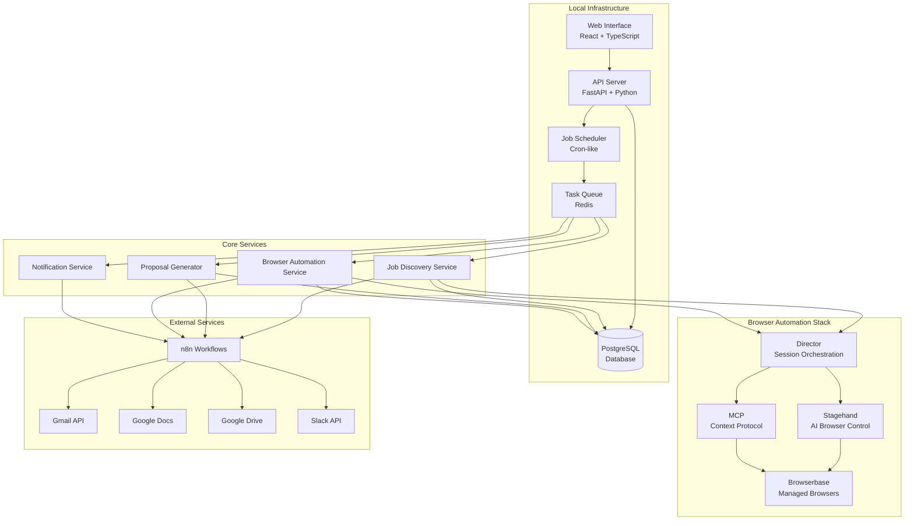

# System Architecture Overview

## High-Level Architecture

The Upwork Automation System follows a microservices architecture with browser automation at its core. The system is designed to scale from manual operations (2-3 applications/day) to automated operations (20-30 applications/day) while maintaining platform compliance.



## Core Components

### 1. Web Interface
- **Technology**: React with TypeScript, Material-UI
- **Purpose**: User dashboard for monitoring and control
- **Key Features**:
  - Real-time job queue monitoring
  - Manual override controls
  - System configuration
  - Performance analytics

### 2. API Server
- **Technology**: FastAPI with Python, SQLAlchemy ORM
- **Purpose**: Central API for all system operations
- **Key Features**:
  - RESTful API endpoints
  - WebSocket connections for real-time updates
  - Authentication and authorization
  - Request/response validation

### 3. Browser Automation Stack
The heart of the system, consisting of four integrated components:

#### Browserbase
- **Purpose**: Managed browser infrastructure
- **Features**:
  - 4 vCPU per browser instance
  - Session persistence and recording
  - Stealth mode and proxy support
  - Live session monitoring

#### Stagehand
- **Purpose**: AI-powered browser automation
- **Features**:
  - Intelligent element detection
  - Dynamic content handling
  - Natural language automation commands
  - Context-aware interactions

#### Director
- **Purpose**: Multi-session orchestration
- **Features**:
  - Parallel session management
  - Workflow orchestration
  - Load balancing
  - Error recovery

#### MCP (Model Context Protocol)
- **Purpose**: AI agent integration
- **Features**:
  - Page context analysis
  - Adaptive strategy generation
  - Learning from interactions
  - Context-aware error recovery

### 4. Core Services

#### Job Discovery Service
- **Purpose**: Automated job finding and filtering
- **Process**:
  1. AI-powered search using multiple strategies
  2. Parallel browser sessions for faster discovery
  3. Intelligent content extraction
  4. Context-aware filtering and ranking

#### Proposal Generator
- **Purpose**: Automated proposal creation
- **Process**:
  1. LLM-based content generation
  2. Template customization
  3. Google Docs integration
  4. Attachment selection

#### Browser Automation Service
- **Purpose**: Automated application submission
- **Process**:
  1. Session management and stealth operations
  2. Form filling and interaction
  3. Submission confirmation
  4. Error handling and recovery

#### Notification Service
- **Purpose**: Real-time alerts and updates
- **Features**:
  - Slack integration
  - Rich notification templates
  - Performance dashboards
  - Emergency alerts

### 5. External Integrations

#### n8n Workflows
- **Purpose**: Low-code workflow orchestration
- **Workflows**:
  - Job discovery pipeline
  - Proposal generation pipeline
  - Browser submission pipeline
  - Notification workflows

#### Google Services
- **Google Docs**: Proposal storage and editing
- **Google Drive**: Attachment management
- **Google Sheets**: Data export and reporting
- **Gmail API**: Email integration

#### Slack Integration
- **Real-time notifications**: Job alerts and status updates
- **Interactive controls**: Manual overrides via Slack
- **Performance dashboards**: Daily/weekly reports
- **Emergency alerts**: Critical failure notifications

## Data Flow

### Job Discovery Flow
1. **Scheduler** triggers job discovery at regular intervals
2. **Job Discovery Service** creates multiple browser sessions
3. **Director** orchestrates parallel search strategies
4. **Stagehand** performs AI-powered job search and extraction
5. **MCP** provides context-aware filtering and ranking
6. **n8n** triggers notification workflows
7. **Database** stores discovered jobs
8. **Slack** sends job discovery notifications

### Proposal Generation Flow
1. **Job Discovery** triggers proposal generation
2. **Proposal Generator** analyzes job requirements
3. **LLM Service** generates personalized content
4. **Google Docs** creates and stores proposal document
5. **Google Drive** selects relevant attachments
6. **Database** stores proposal metadata
7. **Queue** schedules proposal for submission

### Application Submission Flow
1. **Queue** processes submission tasks
2. **Browser Automation Service** gets available session
3. **Director** orchestrates submission workflow
4. **Stagehand** navigates and fills application forms
5. **MCP** handles dynamic content and errors
6. **Browserbase** captures submission confirmation
7. **Database** records application status
8. **Slack** sends success/failure notifications

## Security and Compliance

### Browser Security
- **Stealth Mode**: Advanced fingerprinting protection
- **Proxy Rotation**: IP address rotation for anonymity
- **Session Isolation**: Separate sessions for different operations
- **Rate Limiting**: Human-like application patterns

### Data Security
- **Local Storage**: All sensitive data stored locally
- **Encrypted Credentials**: API keys and passwords encrypted
- **Access Control**: Role-based access to system functions
- **Audit Logging**: Complete audit trail of all operations

### Platform Compliance
- **Rate Limiting**: Configurable limits to avoid detection
- **Human Patterns**: Randomized timing and behavior
- **Error Handling**: Graceful handling of platform changes
- **Monitoring**: Continuous monitoring for unusual responses

## Scalability and Performance

### Horizontal Scaling
- **Browser Sessions**: Multiple parallel sessions
- **Worker Processes**: Scalable background processing
- **Database Connections**: Connection pooling
- **Queue Processing**: Distributed task processing

### Performance Optimization
- **Session Reuse**: Persistent browser sessions
- **Caching**: Intelligent caching of job data
- **Batch Processing**: Efficient bulk operations
- **Resource Management**: Automatic cleanup and optimization

## Monitoring and Observability

### System Metrics
- **Application Success Rate**: Percentage of successful applications
- **Job Discovery Rate**: Jobs found per hour
- **System Performance**: Response times and throughput
- **Error Rates**: Failure rates by component

### Health Monitoring
- **Service Health**: Individual service status
- **Database Health**: Connection and performance metrics
- **External Service Health**: API availability and response times
- **Browser Session Health**: Session status and performance

### Alerting
- **Performance Alerts**: Degraded performance notifications
- **Error Alerts**: Critical error notifications
- **Capacity Alerts**: Resource utilization warnings
- **Security Alerts**: Unusual activity detection

## Deployment Architecture

The system is designed for local deployment with Docker containers:

```yaml
services:
  - api-server: FastAPI application server
  - web-interface: React frontend application
  - worker: Background task processor
  - scheduler: Cron-like job scheduler
  - database: PostgreSQL data storage
  - redis: Task queue and caching
  - n8n: Workflow orchestration
```

Each service is containerized and can be scaled independently based on load requirements.

## Technology Stack Summary

### Backend
- **Python 3.11+**: Core application language
- **FastAPI**: Web framework and API server
- **SQLAlchemy**: Database ORM
- **Alembic**: Database migrations
- **Redis**: Task queue and caching
- **PostgreSQL**: Primary database

### Frontend
- **React 18**: User interface framework
- **TypeScript**: Type-safe JavaScript
- **Material-UI**: Component library
- **WebSocket**: Real-time updates

### Browser Automation
- **Browserbase**: Managed browser infrastructure
- **Stagehand**: AI browser automation
- **Director**: Session orchestration
- **MCP**: Model Context Protocol

### External Services
- **n8n**: Workflow automation
- **Google Workspace**: Document and drive integration
- **Slack**: Notifications and alerts
- **OpenAI**: LLM for proposal generation

This architecture provides a robust, scalable, and maintainable solution for automated Upwork job applications while maintaining security and compliance requirements.